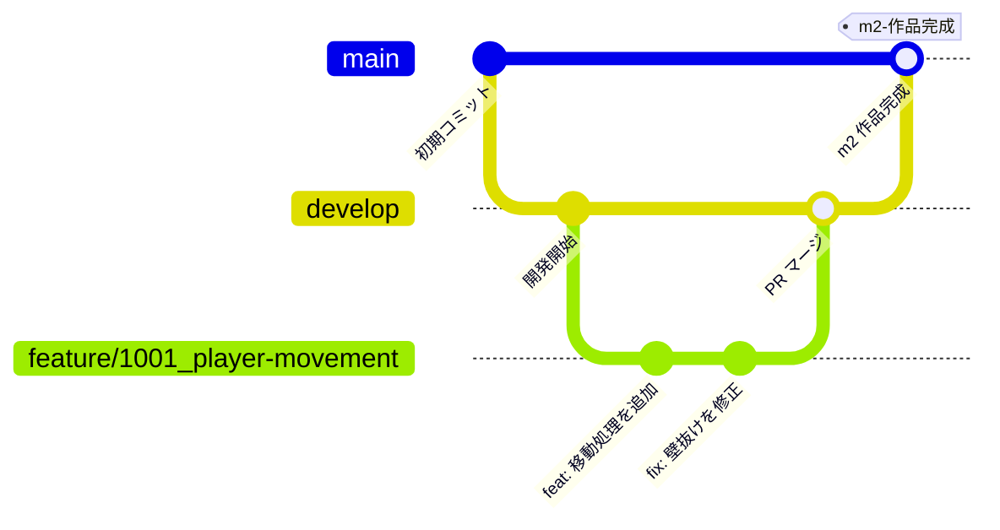

# コントリビューションガイド

本ドキュメントでは、チーム開発における Git 運用ルール（ブランチ・コミット・PR・コンフリクト解消・タグ）を定めます。  
メンバー全員が同じ手順で作業し、Unity プロジェクトの破損や作業の衝突を防ぐことを目的とします。

> **📖 コーディングルール**: コーディングルールは [coding-rules.md](coding-rules.md) を参照してください。

---

## 1. ブランチ戦略

### 1.1 ブランチ一覧

| ブランチ名 | 用途 | 作成元 | マージ先 |
|---|---|---|---|
| `main` | 動作確認済みの安定版（展示・提出用） | — | — |
| `develop` | 開発の統合ブランチ | `main` | `main` |
| `feature/*` | 機能ごとの開発 | `develop` | `develop` |

> [!CAUTION]
> **`main` と `develop` への直接 push は禁止です。** 必ず Pull Request を経由してください。

> **📌 ルール**: `release/*` と `hotfix/*` は使いません。緊急修正も `feature/*` → `develop` → `main` の流れで行います。

### 1.2 ブランチの流れ



### 1.3 feature ブランチの運用

- 命名規則: `feature/<タスク番号>_<機能名>`（例: `feature/1001_player-movement`）
- 機能名は英小文字とハイフンで記述する
- マージ後はブランチを**削除**する
- 展示前・提出前に `develop` から `main` へマージし、マイルストーンタグを付ける（→ [6. マイルストーンタグ](#6-マイルストーンタグ)）

### 1.4 作業の流れ（コマンド例）

```bash
# feature ブランチの作成
git checkout develop
git pull origin develop
git checkout -b feature/1001_player-movement

# 作業・コミット
git add .
git commit -m "feat: プレイヤーの移動処理を追加"

# リモートに push して PR を作成（マージ先は develop）
git push origin feature/1001_player-movement

# PR がマージされたらブランチを削除
git checkout develop
git pull origin develop
git branch -d feature/1001_player-movement
git push origin --delete feature/1001_player-movement
```

---

## 2. Unity 特有の注意

| 項目 | ルール |
|---|---|
| `.meta` ファイル | **必ずコミットする**（アセットと同時に）。欠けると参照が切れる |
| コミットしないフォルダ | `Library/`, `Temp/`, `Logs/`, `obj/`, `UserSettings/` など。`.gitignore` で除外されているか確認する |
| Asset Serialization | `Edit > Project Settings > Editor` で **Force Text** にする |
| 大容量素材 | 動画・高解像度テクスチャ・音源などは**コミット前に相談**する。Git LFS は現時点では使わない |

> [!CAUTION]
> **シーン・Prefab は同時編集しないでください。**  
> 編集前に **事前宣言**（Slack 等で共有）し、同じファイルは **1人が担当** してください。

---

## 3. コミットルール

### 3.1 コミットメッセージの形式

```
<種別>: <要約>
```

| 種別 | 用途 | 例 |
|---|---|---|
| `feat` | 新機能の追加 | `feat: プレイヤーのジャンプ処理を追加` |
| `fix` | バグ修正 | `fix: 敵が壁を抜ける問題を修正` |
| `docs` | ドキュメントの変更 | `docs: README にセットアップ手順を追記` |
| `style` | 動作に影響しない整形 | `style: インデントを統一` |
| `refactor` | 機能を変えない構造改善 | `refactor: 入力処理を InputHandler に分離` |
| `chore` | 設定・素材追加など | `chore: .gitignore に Logs/ を追加` |

> **📌 ルール**: **1コミット1目的**とし、要約は**日本語**で簡潔に書いてください。

---

## 4. Pull Request ルール

### 4.1 タイトル

コミットと同じ形式にします（例: `feat: プレイヤーの移動処理を追加`）。

### 4.2 説明テンプレート

```markdown
## 概要
<!-- 何のための変更か -->

## 変更内容
- 

## 動作確認
- [ ] Unity で開いてエラーが出ない
- [ ] 既存機能に影響がない
- [ ] Debug.Log を残していない
- [ ] .meta が揃っている

## スクリーンショット（任意）
```

### 4.3 レビュー

| 項目 | ルール |
|---|---|
| 承認数 | 最低 **1名** の承認を得てからマージする |
| `develop` → `main` | **リーダーの承認**が必要 |

---

## 5. コンフリクト解消

### 5.1 通常ファイル（スクリプトなど）

`merge` で最新の `develop` を取り込んで解消します。

```bash
git fetch origin
git merge origin/develop

# コンフリクトを手動で解消 → ステージ
git add <解消したファイル>
git commit
```

その後は通常の push を実行してください。

```bash
git push origin feature/1001_player-movement
```

### 5.2 シーン・Prefab

> **📌 ルール**: シーン・Prefab は**手動マージしません**。片方（`develop` 側 または 自分側）を採用し、もう片方の変更は**再作業**します。対応は担当者に相談してください。

```bash
# 自分の変更側を採用する場合（merge 中は ours が自分側）
git checkout --ours <path/to/Scene.unity>

# develop 側を採用する場合（merge 中は theirs が develop 側）
git checkout --theirs <path/to/Scene.unity>

git add <path/to/Scene.unity>
git commit
```

---

## 6. マイルストーンタグ

提出日・審査日ごとに、`main` へマージしたタイミングでタグを付けます。SemVer（`v1.0.0` 形式）は使いません。

| タグ例 | 内容 |
|---|---|
| `m1-企画確定` | 企画の提出時点 |
| `m2-作品完成` | 作品が完成した時点 |
| `m3-搬入` | 展示会場への搬入時点 |

```bash
# develop を main にマージ（PR 経由・リーダー承認後）
git checkout main
git pull origin main

# タグを付けて push
git tag -a m2-作品完成 -m "作品完成時点"
git push origin m2-作品完成
```
